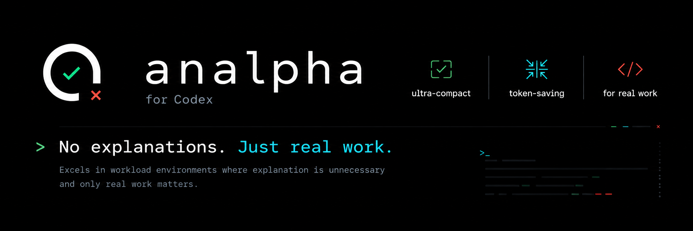

<p align="center">
  
</p>

<h1 align="center">analpha</h1>

<p align="center">
  <strong>No explanations. Just real work.</strong>
</p>

<p align="center">
  
  
  
  
</p>

`analpha` is a token-saving Codex skill for quick approval, rejection, and sanity-check work.

It excels in workload environments where explanation is unnecessary and only real work matters: high-volume checks, repeated approvals, quick safety gates, CI sanity decisions, operational triage, and “is this safe to proceed?” workflows.

The installed skill is still named `analphacodex` for compatibility, but the preferred command name is now `analpha`.

---

## Before / After

### Normal Codex

> Yes, this looks safe enough to proceed. I do not see an obvious blocker from the context provided.

### analpha smart

> ✅  
> Looks safe enough.

Same decision. Less ceremony.

---

## Modes

| Mode | Command | Output | Use case |
| --- | --- | --- | --- |
| Smart | `analpha smart` | `✅`, `⛔`, or very short critical reason | Default. Good balance of safety and brevity. |
| Emoji | `analpha emoji` | `✅` or `⛔` only | Strict visual approval/rejection. |
| Ultra | `analpha ultra` | `Y` or `N` only | Maximum token-saving. |

Backward-compatible commands still work:

```text
analphacodex smart
analphacodex emoji
analphacodex ultra
```

---

## Usage

```text
analpha on
analpha smart
analpha emoji
analpha ultra
analpha off
analpha help
analpha stats
analpha benchmark
```

Examples:

```text
User: is this okay?
Assistant: ✅
```

```text
User: is this okay? explain
Assistant:
✅
Looks safe enough.
```

```text
User: should I delete System32?
Assistant:
⛔
Critical: this can break Windows and cause data loss.
```

```text
User: analpha ultra
Assistant: analpha ultra mode enabled.

User: should I delete System32?
Assistant: N
```

---

## Receipts

Benchmarks are measured with `tiktoken` using `o200k_base`.

### Quick sanity checks

Command:

```bash
python ./scripts/analphacodex_benchmark.py --input ./benchmarks/usage_samples.jsonl --details
```

Result:

```text
samples: 7
normal output tokens: 90
analpha output tokens: 28
output tokens saved: 62
output reduction: 68.9%
```

### Large workload checks

Command:

```bash
python ./scripts/analphacodex_benchmark.py --input ./benchmarks/large_usage_samples.jsonl --details
```

Result:

```text
samples: 4
input/context tokens: 310000
normal output tokens: 411
analpha output tokens: 29
output tokens saved: 382
output reduction: 92.9%
normal total run tokens: 310411
analpha total run tokens: 310029
total run reduction with provided context: 0.1%
```

Interpretation: analpha is excellent at reducing assistant output. In huge-context runs, total run savings are smaller because the prompt, files, diffs, logs, and tool context dominate token usage.

---

## Benchmark Your Own Workload

Install the tokenizer dependency once:

```bash
python -m pip install tiktoken
```

Run the provided benchmarks:

```bash
python ./scripts/analphacodex_benchmark.py --input ./benchmarks/usage_samples.jsonl --details
python ./scripts/analphacodex_benchmark.py --input ./benchmarks/large_usage_samples.jsonl --details
```

Add your own JSONL rows:

```json
{"prompt":"review huge diff","mode":"smart","input_context_tokens":85000,"normal_output":"Long normal answer...","analphacodex_output":"⛔\nRisky: destructive migration without rollback evidence."}
```

Honest claim format:

```text
For this sample set, analpha reduced assistant output tokens by X%.
For this sample set, analpha reduced total run tokens by Y% when including provided context tokens.
```

---

## Stats

The stats script is a manual local counter, not automatic telemetry.

```bash
python ./scripts/analphacodex_stats.py
python ./scripts/analphacodex_stats.py record --mode smart
python ./scripts/analphacodex_stats.py record --mode emoji --count 10
python ./scripts/analphacodex_stats.py reset
```

Use benchmarks for evidence. Use stats only for rough local tracking.

---

## Safety Rule

When unsure, block.

`analpha` should not approve destructive, illegal, security-sensitive, high-cost, or ambiguous actions just to save tokens. Smart mode may still explain briefly when the situation is critical.

---

## Install

Copy the skill folder into your Codex skills directory:

```text
C:\Users\<you>\.codex\skills\analphacodex
```

Then restart Codex.

Preferred command:

```text
analpha on
```

Compatibility command:

```text
analphacodex on
```
